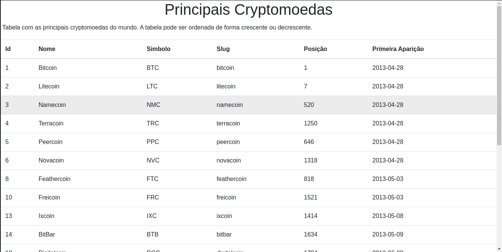
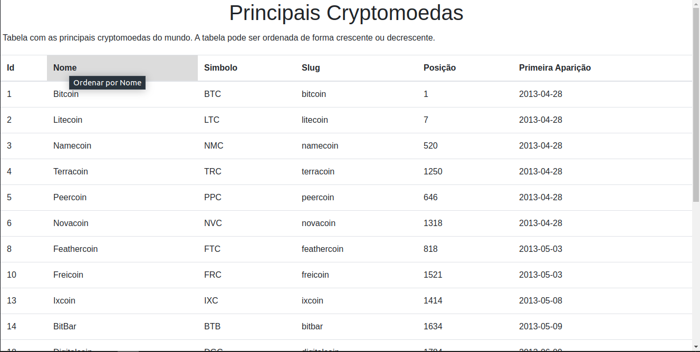
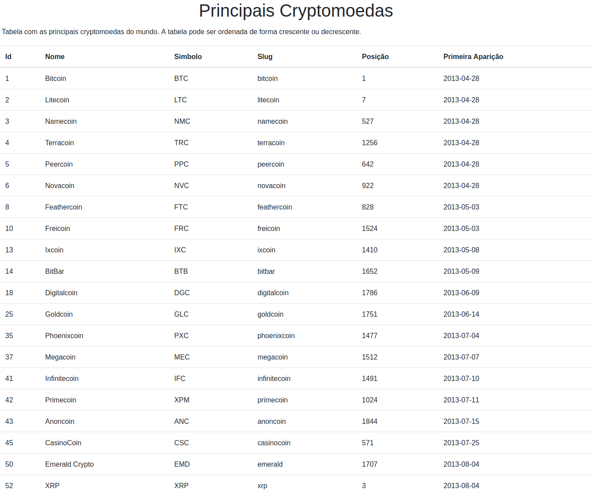
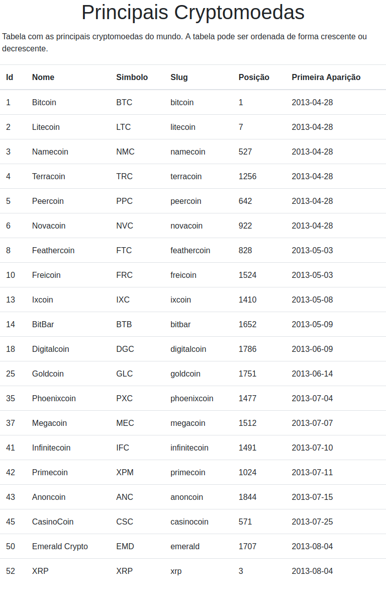
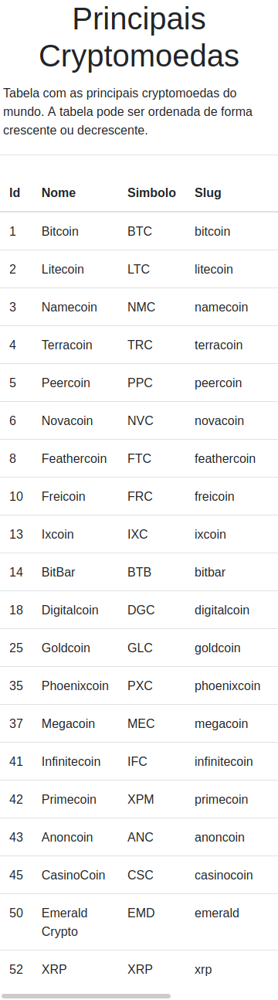

# Requisitando dados de uma API de cryptomoedas

O projeto consiste em uma página que consome dados da **API de Cryptomoedas da CoinMarketCap**. Possui uma tabela limitada a 20 cryptomoedas, a tabela pode ser ordenada de forma crescente ou decrescente.

#### Como foi desenvolvida
1. Foi utilizada a **Fetch API**, uma ferramenta disponibilizada pelo próprio JavaScript, para manipular requisões **HTTP**. Essa funcionabilidade fornece o método global **fetch()**, que de maneira fácil e lógica permite buscar recursos de forma **assincrona**.
2. No desenvolvimento da **tabela** foi utilizado **JavaScript puro** para se obter as opções de **ordenação**, pode ser ordenada de maneira crescente ou decrescente.
3. Bootstrap para o layout.

#### Como Executar
1. Deve ser executada em um servidor local, localhost ou outro.
2. Você deve possuir uma chave/id da CoinMarketCap, obtida através de um cadastro no site.
3. A chave deve atribuida a constante **apiKey** no arquivo **getApi.js**, que está na pasta **js**.

#### Prints
1.  Print do mouse sobre uma celula.

2. Print do mouse sobre uma celula do cabeçalho da tabela, as celulas do cabeçalho da tabela servem para ordenar uma coluna. 

3. Print em um Desktop

4. Print em um Tablet

5. Print em um Smartphone

